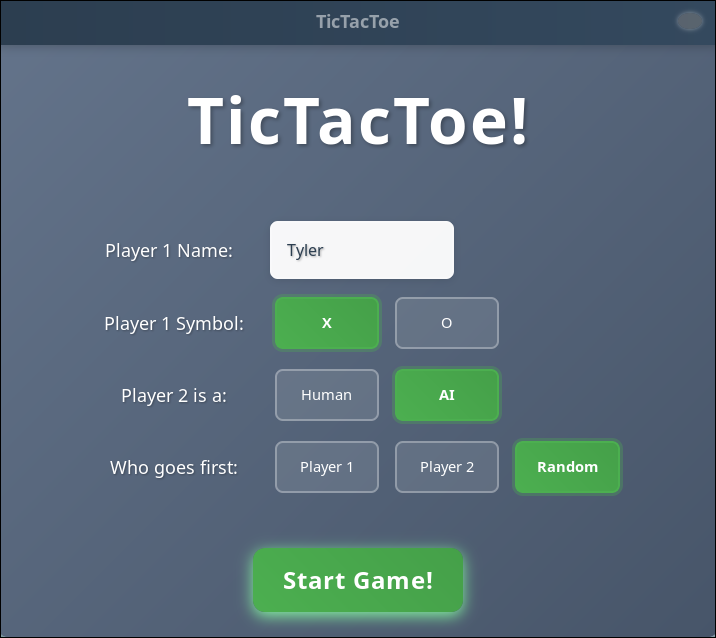
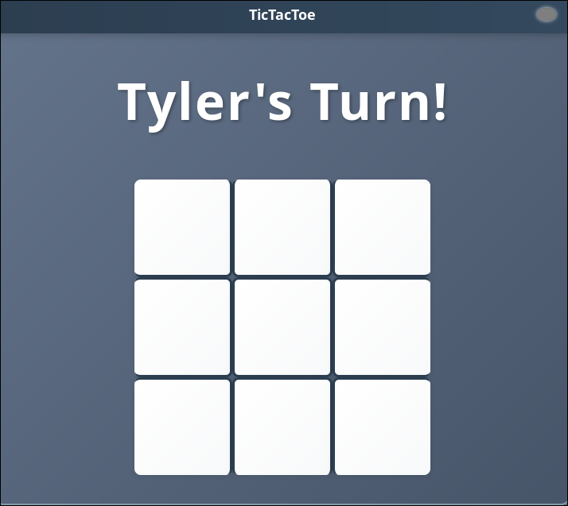
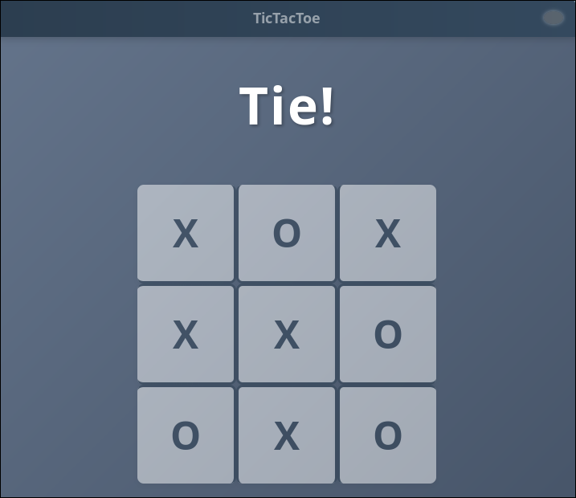

# Tic-Tac-Toe

~~A command-line implementation of the classic Tic-Tac-Toe game where players can play against an AI opponent with multiple difficulty settings.~~

This was a CLI Implementation of the classic Tic-Tac-Toe game (click <a href="https://github.com/Ty700/Tic-Tac-Toe/tree/cli">here</a> for the CLI version) but now it has upgraded with the recent implementation of a GUI using the GTKMM 4.0 library!

## Back Story

This was my first "big" project when I was learning C++ and programming fundamentals. I decided to revisit it and enhance it with some new features. If you're curious about the original version, switch to the [TicTacToe2023 branch](https://github.com/Ty700/TicTacToeVsCPU/tree/TicTacToe2023) and prepare your eyes for that monstrosity. This was prior to my knowledge of git, so I straight up copied and pasted the code into GitHub, forgetting to add the .cpp extension for color formatting. Hence, the latest commit is only a few months old (at the time of this writing).

## Features

- Player vs. AI gameplay

- Three AI difficulty levels:

- Easy: makes random moves

- Medium: combines strategy with some randomness

- Hard: implements the Minimax algorithm for optimal play (unbeatable)

- Colorized board with red 'X' and blue 'O'

- Configurable player names and symbols

- Option to select which player goes first

## Building the Game

### Prerequisites  

- A Linux-based operating system

- C++ compiler with C++17 or later support

- Python 3.6 or later

- <a href="https://gnome.pages.gitlab.gnome.org/gtkmm-documentation/chapter-installation.html">GTKMM 4.0</a> and its dependencies

### This game doesn't compile for Windows (YET). This is in-progress. 

### Compilation

You can compile the program using the automated python build script: 

#### Production Version

```python3 build.py```

#### Debug Version 

```python3 build.py -d```

You can also clean the binaries and CMake files via:

```python3 build.py -c```

## Gameplay  

1. Configure the game through the setup menu:

- Set your name

- Select your symbol

- Choose to play against an AI or Player

- Decide who goes first

2. During the game:

- Select one of the 9 slots to put your symbol (X/O)

3. The game ends when either:

- A player gets three of their symbols in a row, column, or diagonal

- All positions are filled, resulting in a tie

## Screenshots

#### Game Setup vs AI:




#### Gameplay:





#### Game Statistics CSV 


#### Game Statistics Text 


## File Structure

- tictactoe.cpp: main program entry point

- tactactoewindow.cpp/h: Controls the bulk of the GUI

- Game.cpp/h: Handles the game logic and board state

- Slot.cpp/h: Handles the 9 Tic-Tac-Toe slots players can place their piece on

- Player.cpp/h: Defines player attributes and behaviors

- AIMoves.cpp/h: Contains AI algorithms for different difficulty levels

- GameStats.cpp/h: Logic behind the tracking of game statistics 

- GameStatsDB.csv: The CSV file contains the following columns:

	- Game ID 

	- Player One Name 

	- Player Two Name
	
	- Winner Name 

	- Whether Winner is AI (T/F)

	- Winner Symbol (X/O)
 
## AI Implementation  

### Easy Mode

- Makes a completely random moves with no strategy.  

### Medium Mode

- Uses a prioritized strategy:

1. Tries to win if possible

2. Blocks the player if they're about to win

3. Takes the center position if avaliable

4. Takes a corner position if avaliable

5. Makes a random move if none of the above applies

### Hard Mode

- Implements the Minimax algorithm to make optimal moves, resulting in an unbeatable gameplay. The AI with either win or force a draw.
  
## Game Statistics 

- The game includes a comprehensive statistics tracking system that records the results of each game played. This feature allows players to review their game history and track performance over time.

### Features

1. Automatically tracks all game results

2. Records player names, and winner information

3. Maintains both a structured CSV database and human-readable game logs 

### Implementation Details 

- Game statistics are updated automatically at the end of each game. 

- The system handles file creation, reading, and writing operations with robous error handling.

- Data integrity is mainted through careful file state management

### Viewing Statistics 

- Players can view their game history by opening the GameStats.txt file, which provides detailed information about each game in an easy-to-read format.

## Future Improvements (In order of priority) 

- **Windows Build option**

- **Network Play**

## Learnings

### GTKMM Library
- This was my first project ever using a GUI library. It was really fun to learn and now I feel confident in my ability to make other programs with a GUI!

### Templates and Callbacks 
- This was also the first project where I used a template and callback. 

### Data Structure Optimizations
- Implementing a bitmap to track player moves proved more efficient than individual character tracking. This insight came after having to convert all character representations to `std::string` to support the GameStats system, highlighting how initial design choices impact later extensibility.
- The bitmap approach enables cleaner game state representation: positions can be checked with simple bit operations, and display logic becomes more straightforward (e.g., "if position bit is 0, display X; otherwise display O").

### Coding Style Evolution
- Throughout this project (which expanded beyond its initial scope as I explored different aspects of C++), my coding style transitioned from K&R to Allman bracing style.
- While the adjustment still feels somewhat unnatural, adopting the Allman style aligns with my workplace standards, making this project a valuable opportunity to build new muscle memory for professional coding practices.
